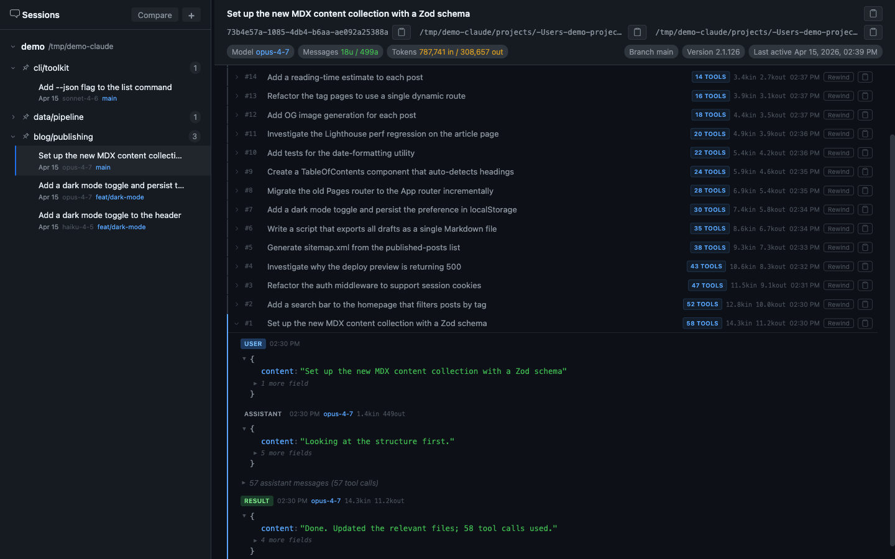
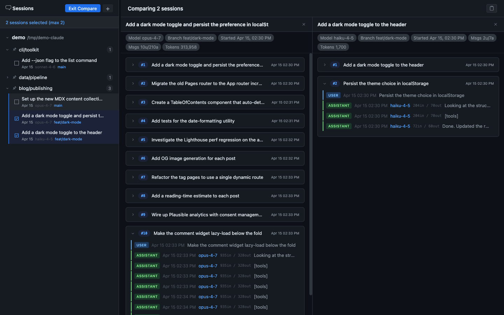
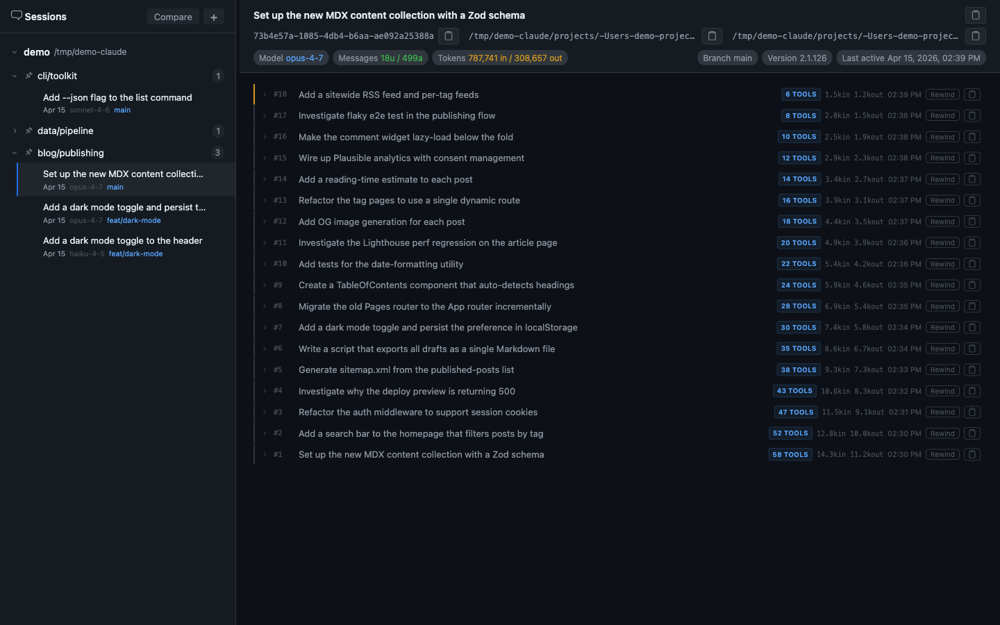

# cc-session-viewer

Browse, compare, and copy transcripts of Claude Code conversation logs.


---

## Quick start

Run instantly with no install:

```bash
npx cc-session-viewer
```

Or install globally so the command is always available:

```bash
npm install -g cc-session-viewer
cc-session-viewer
```

Opens `http://localhost:3333`. Auto-detects `~/.claude` as your session root — no configuration needed.

---

## What it does

Claude Code writes every session to a JSONL file in `~/.claude/projects/`. These files are the full record of everything the agent did — every tool call, every reasoning step, every token consumed — but they're unreadable without tooling.

`cc-session-viewer` turns those logs into a navigable interface.

### Session viewer

Every user prompt becomes a **checkpoint** — a row showing the prompt text, tool call count, per-direction token cost, and timestamp. Expanding a checkpoint reveals the full message sequence with collapsible tool call groups.



What looks like "Claude edited 3 files" in the terminal is often 12 file reads, 4 grep searches, 2 bash validations, then the edit. The tool call groups make that sequence explicit.

### Session comparison

Enter Compare mode, pick two sessions, and view them side by side in independently scrollable columns. Each column shows that session's metadata — model, message count, total tokens, branch, start time — alongside its checkpoint list.



Use this to compare model choices (opus vs haiku on the same task), prompting strategies, or approaches to the same problem across different sessions.

### Sidebar

Projects are listed under their `.claude` root. Each project shows its session count. Sessions display model, date, git branch, and last-active time as metadata badges. Frequently-visited projects can be pinned to the top.



---

## Features

| Feature | Description |
|---|---|
| **Multi-root browsing** | Add multiple `.claude` folders — not just `~/.claude` |
| **Checkpoint grouping** | Each user prompt groups all agent activity beneath it |
| **Collapsible tool calls** | Consecutive tool-use messages collapse into a labelled group |
| **Per-message tokens** | Input and output token count on every individual message |
| **Session metadata** | Model, branch, version, message count, total tokens, last-active |
| **Session comparison** | Select 2 sessions for side-by-side scrollable comparison |
| **Rewind** | Jump back to any checkpoint state |
| **Copy transcript** | Full session, per-turn, or comparison selection as plain text |
| **Session rename** | Give sessions meaningful titles |
| **Project pinning** | Surface frequently-used projects at the top of the sidebar |
| **Markdown export** | CLI script to export sessions to `.md` files |

---

## CLI options

```bash
# Custom session root
npx cc-session-viewer --roots /path/to/.claude

# Multiple roots, comma-separated
npx cc-session-viewer --roots "/path/one/.claude,/path/two/.claude"

# Don't auto-open the browser
npx cc-session-viewer --no-open

# Custom port
npx cc-session-viewer --port 4000
```

---

## Export sessions to Markdown

Export sessions as plain-text `.md` files — useful for feeding transcripts to other LLMs or for search indexing. Output mirrors `projects/{projectId}/{sessionId}/transcript.md` with sub-agent logs at `subagents/agent-*.md`.

```bash
# List all projects
npm run list-projects
npm run list-projects -- -r /path/to/.claude

# Export a specific project
npm run export-md -- --out ./my-export --project -Users-you-Documents-your-repo

# Export everything
npm run export-md -- --out ./all-md --all -r ~/.claude

# Dry run
npm run export-md -- --dry-run -o ./tmp -p YOUR_PROJECT_ID
```

Run `npm run export-md -- --help` for all options.

### Count tokens in exported files

Uses [tiktoken](https://github.com/openai/tiktoken) in a local venv:

```bash
npm run count-tokens
npm run count-tokens -- --format md
npm run count-tokens -- --help
```

---

## Development

```bash
# Terminal 1 — Express API server
npx tsx bin/cli.ts --dev --no-open

# Terminal 2 — Vite dev server (hot reload)
npx vite
```

App at `http://localhost:5173`. Vite proxies `/api` to the Express backend on port 3333.

```bash
# Custom roots in dev
npx tsx bin/cli.ts --dev --no-open --roots "/path/to/.claude,/other/.claude"

# Clean build
rm -rf dist build && npm run build
```
